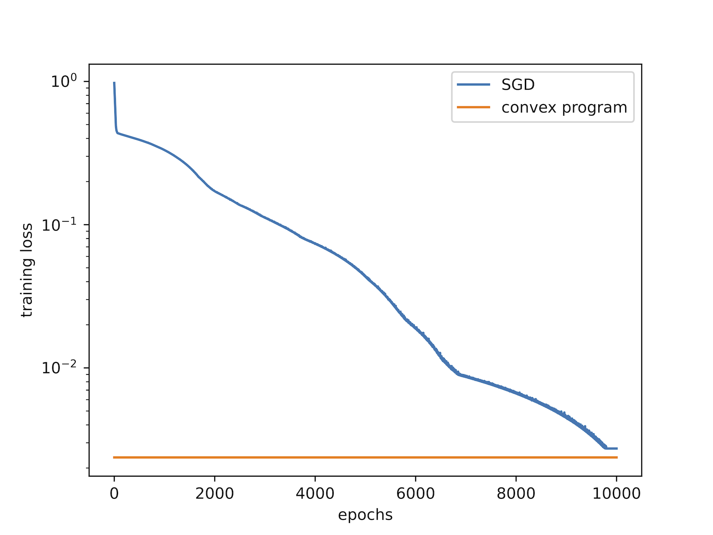

# convex-relu-nn

Convex reformulation of ReLU neural networks based on [[1]](#1) and [[2]](#2), exploration of application to prototypical networks [[3]](#3).

## References
<a id="1">[1]</a>
Mert Pilanci and Tolga Ergen. [Neural networks are convex regularizers: Exact polynomial-time convex optimization formulations for two-layer networks](http://proceedings.mlr.press/v119/pilanci20a/pilanci20a.pdf). In Proceedings of the 37th International Conference on Machine Learning, ICML’20. JMLR.org, 2020.

<a id="2">[2]</a>
Tolga Ergen and Mert Pilanci. [Implicit convex regularizers of cnn architectures: Convex optimization of two- and three-layer networks in polynomial time](https://arxiv.org/abs/2006.14798), 2020.

<a id="3">[3]</a>
Jake Snell, Kevin Swersky, and Richard S. Zemel. [Prototypical networks for few-shot learning](http://arxiv.org/abs/1703.05175). CoRR, abs/1703.05175, 2017.